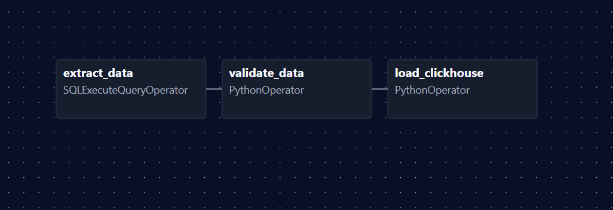

# Interswitch Assessment

A comprehensive solution covering advanced SQL analysis, data scripting, and automated data pipeline orchestration.

## 📁 Project Structure

```
Interswitch_Assessment/
│
├── Question1 Part A - Advanced SQL C Analysis/
│   └── weekend_trips.sql
│
├── Question1 Part B/
│   └── reporting_chain.sql
│
├── Question2 Part A - Scripting C Data Manipulation/
│   └── band.py
│
└── README.md
```

---

## Question 1: Advanced SQL Analysis

### Part A - Weekend Trips Analysis

**File:** `Question1 Part A - Advanced SQL C Analysis/weekend_trips.sql`

Comprehensive analysis of weekend trip data spanning 2014-2016.

**Features:**
- Calculates average daily trip counts for Saturdays vs Sundays
- Computes average fare amounts per trip by day type
- Determines average trip duration metrics
- Groups results by month for temporal analysis

**Output Columns:**
- `month` - Month in YYYY-MM format
- `sat_mean_trip_count`, `sun_mean_trip_count` - Average daily trips
- `sat_mean_fare_per_trip`, `sun_mean_fare_per_trip` - Average fare amounts
- `sat_mean_duration_per_trip`, `sun_mean_duration_per_trip` - Average trip duration

### Part B - Reporting Chain Query

**File:** `Question1 Part B/reporting_chain.sql`

Generates organizational hierarchy showing employee reporting structure.

**Features:**
- Retrieves each employee with their direct manager
- Includes manager's manager (2-level hierarchy)

**Output Columns:**
- `emp_id` - Employee identifier
- `first_name`, `last_name` - Employee full name
- `manager_1_full_name` - Direct manager's name
- `manager_2_full_name` - Manager's manager's name

---

## Question 2: Scripting & Pipeline Automation

### Part A - Band Data Manipulation

**File:** `Question2 Part A - Scripting C Data Manipulation/band.py`

Python script for processing and analyzing band preferences data.

**Functionality:**
- **Part A. Question1:** Identifies top 2 most liked bands (includes ties)
- **Part A. Question2:** Lists each band with colleagues who like it
- Data aggregation and ranking logic

**Run Command:**
```bash
python band.py
```


### Part B - Pipeline Overview

This Apache Airflow DAG automates a complete ETL workflow that:

1. **Extracts** weekend trip report from PostgreSQL (2014-2016)
2. **Validates** the output data is not empty and that the time interval
3. **Loads** validated data into ClickHouse
4. **Notifies** via email on success or failure

```
airflow/dags/
│
├── weekend_trip_report.py
│
├── email_alert/
│   └── email_alert.py
│
├── include/
│   └── load_to_ch.py
│   └── validate_data.py
│
├── sql/
   └── weekend_trips.sql
```

**DAG Name:** `weekend_trip_report`
**Schedule:** Configurable (default: Daily)
**Retries:** 1 retry with 2-minute delay per task

## 🏗️ Architecture


### System Requirements

- **Apache Airflow:** 2.0 or higher
- **Python:** 3.8 or higher
- **PostgreSQL:** Database with weekend trip data
- **ClickHouse:** Database for storing results